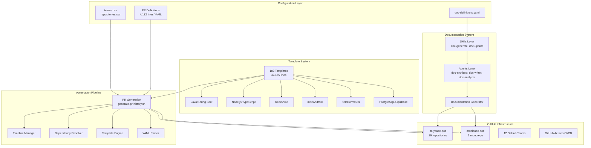
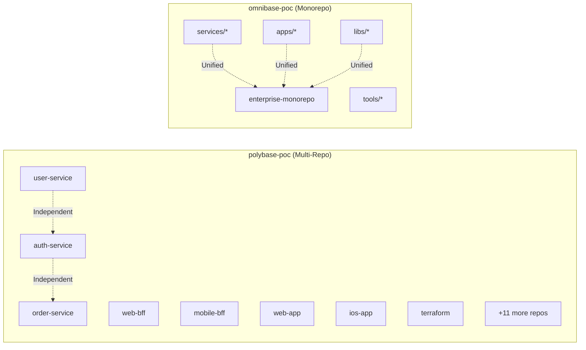
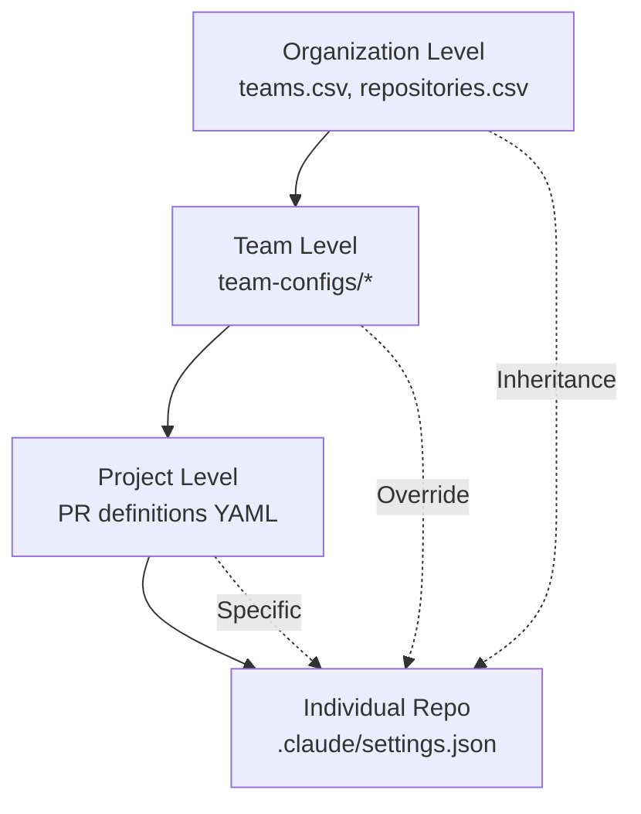
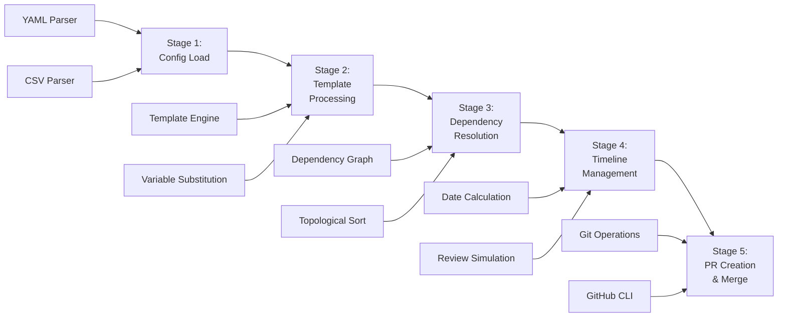
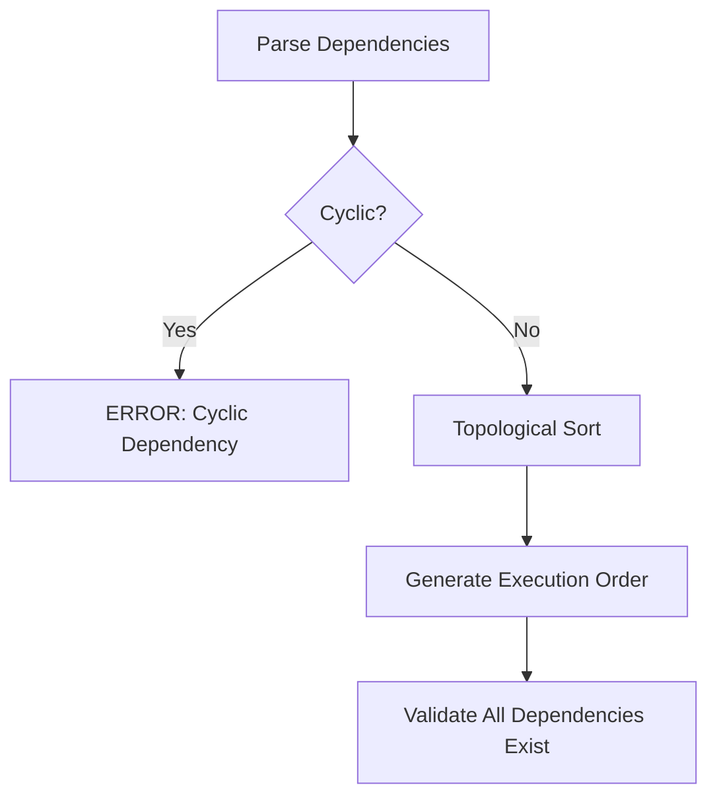
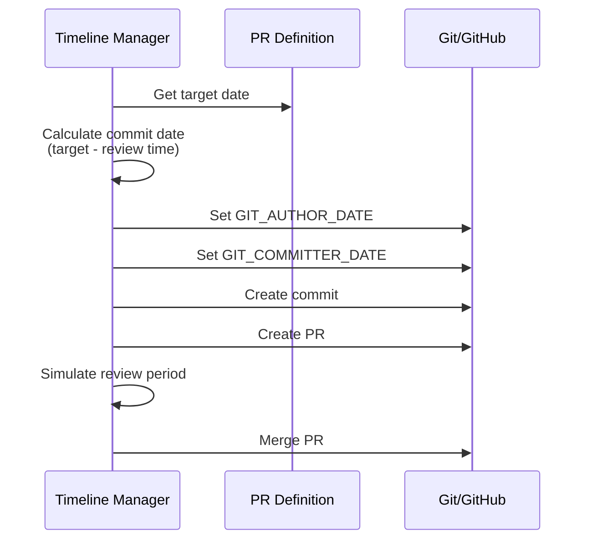
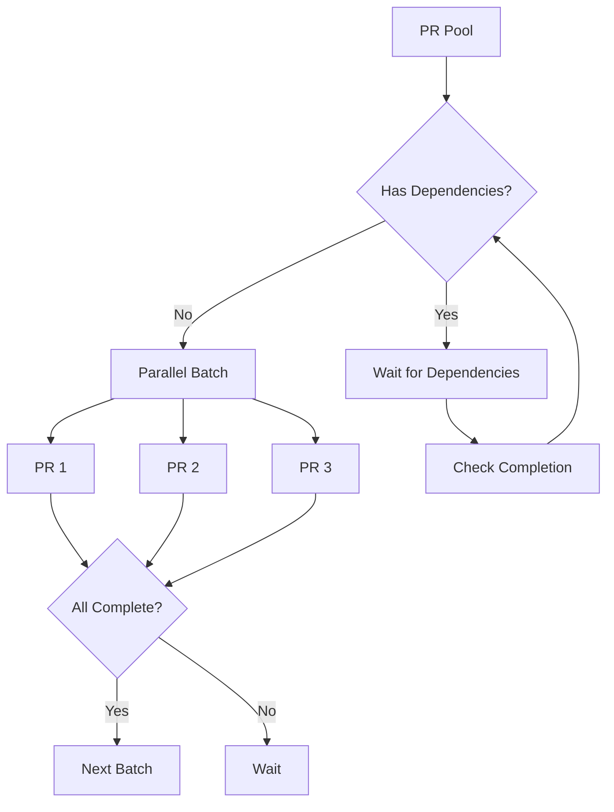
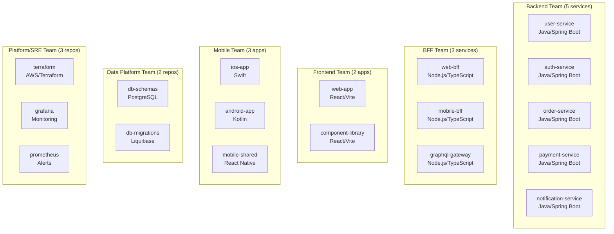
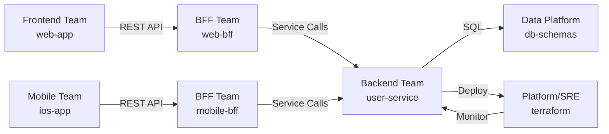

# Architecture Documentation

## Table of Contents

1. [Overview](#overview)
2. [System Architecture](#system-architecture)
3. [Repository Organization](#repository-organization)
4. [PR Generation Pipeline](#pr-generation-pipeline)
5. [Configuration System](#configuration-system)
6. [Template System](#template-system)
7. [Documentation System](#documentation-system)
8. [Team Structure](#team-structure)
9. [Technology Stack](#technology-stack)
10. [Design Decisions](#design-decisions)

## Overview

The first-agentic-ai project is an enterprise case study demonstrating advanced repository evolution patterns using Claude Code as the orchestration layer. It showcases two organizational approaches (multi-repo and monorepo) with comprehensive automation for PR generation, documentation, and infrastructure management.

### Key Metrics

- **Organizations**: 2 (polybase-poc, omnibase-poc)
- **Repositories**: 20 total (19 multi-repo + 1 monorepo)
- **Teams**: 6 (Data Platform, Backend, BFF, Frontend, Mobile, Platform/SRE)
- **PRs Generated**: 45 across all repositories
- **Templates**: 183 files (42,465 lines of code)
- **Automation Scripts**: 10,854 lines
- **PR Definitions**: 4,132 lines of YAML configuration
- **Presentation Images**: 7 SVG visualizations

### Project Goals

1. Demonstrate multi-repo vs monorepo patterns at enterprise scale
2. Showcase Claude Code extensibility (Skills, Agents, Tools)
3. Automate PR generation with dependency management and timeline simulation
4. Provide reusable templates for 6 technology stacks
5. Create comprehensive documentation system with auto-generation capabilities

## System Architecture

The project consists of four major subsystems working together:



### Architectural Patterns

#### 1. Multi-Repo vs Monorepo Pattern

The project demonstrates both patterns simultaneously:



**Multi-Repo (polybase-poc)**:
- 19 independent repositories
- Team autonomy and isolation
- Independent deployment cycles
- Service-specific CI/CD
- Technology diversity

**Monorepo (omnibase-poc)**:
- Single unified repository
- Shared tooling and dependencies
- Coordinated releases
- Nx workspace for build optimization
- Cross-team code sharing

#### 2. Configuration Hierarchy

The system uses a 4-level configuration hierarchy:



**Level 1 - Organization**: Global settings, team definitions, repository list
**Level 2 - Team**: Team-specific rules, workflows, tech stacks
**Level 3 - Project**: PR definitions, dependencies, timelines
**Level 4 - Individual**: Repository-specific overrides, local customizations

## Repository Organization

### Directory Structure

```
first-agentic-ai/
├── .claude/                          # Claude Code integration
│   ├── agents/                       # Custom agents (3 agents)
│   │   ├── doc-architect.agent.md
│   │   ├── doc-analyzer.agent.md
│   │   └── doc-writer.agent.md
│   ├── skills/                       # Custom skills (3 skills)
│   │   ├── doc-generate.skill.md
│   │   ├── doc-update.skill.md
│   │   └── doc-check.skill.md
│   ├── archives/                     # Session archives
│   └── settings.json                 # Repository configuration
│
├── config/                           # Configuration files
│   ├── repositories.csv              # 20 repository specs
│   ├── teams.csv                     # 12 team definitions
│   ├── workspace.conf                # Local workspace settings
│   ├── doc-definitions.yaml          # Documentation targets
│   ├── pr-definitions-month1-2.yaml  # 923 lines - Early PRs
│   ├── pr-definitions-month3-4.yaml  # 1,036 lines - Mid PRs
│   ├── pr-definitions-month5-6.yaml  # 1,113 lines - Late PRs
│   └── monorepo-pr-definitions.yaml  # 734 lines - Monorepo PRs
│
├── scripts/                          # Automation scripts
│   ├── generate-pr-history.sh        # Main PR orchestrator
│   ├── automated-doc-generation.sh   # Documentation automation
│   ├── deploy-doc-system.sh          # Deploy doc system
│   ├── generate-monorepo-service.sh  # Monorepo service generator
│   ├── setup-github-infrastructure.sh # GitHub setup
│   └── lib/                          # Shared libraries
│       ├── yaml-parser.sh            # YAML parsing
│       ├── pr-generator.sh           # PR creation logic
│       ├── template-engine.sh        # Template processing
│       ├── timeline-manager.sh       # Timeline simulation
│       ├── dependency-resolver.sh    # Dependency graph
│       └── (15 more utility scripts)
│
├── templates/                        # Code templates (183 files)
│   ├── common/                       # Shared templates
│   ├── java-service/                 # Spring Boot templates
│   ├── node-service/                 # Express/TypeScript templates
│   ├── react-app/                    # React/Vite templates
│   ├── mobile-ios/                   # iOS Swift templates
│   ├── mobile-android/               # Android Kotlin templates
│   ├── terraform/                    # Infrastructure templates
│   ├── database/                     # PostgreSQL/Liquibase templates
│   ├── team-configs/                 # Team-specific configs
│   └── documentation/                # Doc templates
│
├── images/                           # Presentation visuals (7 SVG)
│   ├── 01-project-results-dashboard.svg
│   ├── 02-architecture-comparison.svg
│   ├── 03-team-structure-tech-stacks.svg
│   ├── 04-configuration-hierarchy.svg
│   ├── 05-team-specific-workflows.svg
│   ├── 06-pr-generation-pipeline.svg
│   └── 07-claude-code-extensibility-docs.svg
│
├── logs/                             # Execution logs
├── docs/                             # Project documentation
│   ├── ARCHITECTURE.md               # This file
│   └── SETUP.md                      # Setup guide
│
└── (Root documentation files)
    ├── README.md                     # Project overview
    ├── AGENT_HANDOFF_GUIDE.md        # Agent onboarding guide
    ├── IMPLEMENTATION_COMPLETE.md    # Implementation summary
    └── (Additional reference docs)
```

### Repository Types

The system supports 9 repository types:

| Type | Count | Template Files | Tech Stack |
|------|-------|----------------|------------|
| java-service | 5 | 28 files | Spring Boot 3.2, Maven, JUnit |
| node-service | 4 | 24 files | TypeScript, Express, Jest |
| react-app | 2 | 22 files | React 18, Vite, Vitest |
| mobile-ios | 1 | 18 files | Swift, SwiftUI, XCTest |
| mobile-android | 1 | 18 files | Kotlin, Jetpack Compose |
| database | 2 | 15 files | PostgreSQL, Liquibase |
| terraform | 1 | 20 files | Terraform, AWS |
| config | 2 | 12 files | YAML, JSON configs |
| monorepo | 1 | 45 files | Nx, Turborepo, multiple stacks |

## PR Generation Pipeline

The PR generation pipeline is a 5-stage process:



### Stage 1: Configuration Loading

**Inputs**:
- `config/pr-definitions-*.yaml` (4 files, 4,132 lines total)
- `config/repositories.csv` (20 repositories)
- `config/teams.csv` (12 teams)

**Processing**:
- Parse YAML with custom parser (handles multi-line strings, nested structures)
- Validate PR definitions (required fields, date formats, dependency references)
- Build in-memory data structure

**Outputs**:
- Validated PR definition objects
- Repository metadata
- Team assignments

### Stage 2: Template Processing

**Inputs**:
- PR definitions with template references
- `templates/` directory (183 files)
- Variable substitution rules

**Processing**:
- Load template files based on PR type
- Substitute variables: `{{REPO_NAME}}`, `{{SERVICE_NAME}}`, `{{TEAM}}`, etc.
- Process conditional sections
- Generate file content

**Outputs**:
- Rendered code files ready to commit
- File paths with correct naming

### Stage 3: Dependency Resolution

**Inputs**:
- PR definitions with `depends_on` fields
- Existing PR state (completed, pending)

**Processing**:


**Algorithm**:
1. Build directed acyclic graph (DAG)
2. Detect cycles (error if found)
3. Perform topological sort
4. Generate execution order respecting dependencies

**Outputs**:
- Ordered list of PRs to create
- Dependency tree visualization
- Blocked PR list

### Stage 4: Timeline Management

**Inputs**:
- Ordered PR list
- Target dates from PR definitions
- Review time estimates

**Processing**:


**Features**:
- Backdating commits to simulate historical timeline
- Review time simulation (configurable per PR)
- Realistic merge patterns
- Respect business days (optional)

**Outputs**:
- Git commits with correct dates
- PRs with realistic review timeline
- Merged PRs in chronological order

### Stage 5: PR Creation & Merge

**Inputs**:
- Rendered templates
- Timeline-adjusted dates
- GitHub credentials

**Processing**:
1. Create feature branch: `feature/{pr-id}-{description}`
2. Commit files with backdated timestamp
3. Push branch to GitHub
4. Create PR with `gh pr create`
5. Simulate review time (sleep or instant)
6. Merge PR with `gh pr merge --squash`
7. Update dependency tracker

**Outputs**:
- Created branches
- Merged PRs
- GitHub commit history
- PR metadata (number, URL, status)

### Parallel Execution

The pipeline supports parallel PR creation for independent PRs:



**Algorithm**:
1. Group PRs by dependency level
2. Create level 0 PRs in parallel
3. Wait for completion
4. Create level 1 PRs in parallel
5. Repeat until all PRs created

**Performance**: Reduces generation time from O(n) to O(max_depth) where depth is dependency chain length.

## Configuration System

### Configuration Files

#### 1. repositories.csv

Format: `org,name,type,description,visibility,team`

Example:
```csv
polybase-poc,user-service,java-service,"User management and profile microservice",private,backend
polybase-poc,auth-service,java-service,"Authentication and authorization service with JWT",private,backend
omnibase-poc,enterprise-monorepo,monorepo,"Enterprise unified monorepo with all teams and services",private,all
```

**Fields**:
- `org`: GitHub organization (polybase-poc or omnibase-poc)
- `name`: Repository name (must be unique within org)
- `type`: Template type to use
- `description`: Human-readable description
- `visibility`: private or public
- `team`: Owning team slug

#### 2. teams.csv

Format: `org,team_name,team_slug,description,permission`

Example:
```csv
polybase-poc,Backend Engineers,backend,"Backend microservices development",push
polybase-poc,Frontend Engineers,frontend,"Web application development",push
```

**Fields**:
- `org`: GitHub organization
- `team_name`: Display name
- `team_slug`: URL-safe identifier
- `description`: Team purpose
- `permission`: GitHub permission level (pull, push, admin)

#### 3. PR Definition YAML

Structure:
```yaml
prs:
  - id: "BACKEND-001"
    title: "Add health check endpoint"
    description: "Implement /health endpoint for readiness checks"
    repository: "user-service"
    author: "Backend Team"
    labels:
      - "enhancement"
      - "backend"
    target_date: "2025-08-15"
    review_time_hours: 4
    depends_on:
      - "INFRA-001"  # Requires infrastructure setup first
    files:
      - path: "src/main/java/com/example/controller/HealthController.java"
        template: "java-service/HealthController.java"
      - path: "src/test/java/com/example/controller/HealthControllerTest.java"
        template: "java-service/HealthControllerTest.java"
```

**Key Features**:
- Dependency tracking with `depends_on`
- Timeline control with `target_date` and `review_time_hours`
- Template references for code generation
- Label and team assignments
- Support for multi-file PRs

#### 4. doc-definitions.yaml

Structure:
```yaml
documentation_targets:
  - repo: user-service
    org: polybase-poc
    team: backend
    priority: high
    doc_types:
      - readme
      - architecture
      - api
      - setup
    diagrams:
      - architecture_overview
      - sequence_authentication
      - erd_user_models
```

**Purpose**: Configure automated documentation generation for repositories.

### Configuration Hierarchy Resolution

When loading configuration, the system merges settings in this order (later overrides earlier):

1. Organization defaults (hardcoded in scripts)
2. Team-level configuration (templates/team-configs/)
3. Project-level configuration (config/ YAML files)
4. Repository-level overrides (.claude/settings.json)

Example:
```
DEFAULT: max_pr_size = 500 lines
TEAM: backend max_pr_size = 1000 lines
PROJECT: pr-definitions.yaml (no override)
REPO: user-service max_pr_size = 800 lines
RESULT: user-service uses 800 lines
```

## Template System

### Template Engine

The template engine supports:

1. **Variable Substitution**:
   ```
   {{REPO_NAME}} → user-service
   {{SERVICE_NAME}} → UserService
   {{PACKAGE_NAME}} → com.example.userservice
   {{TEAM}} → backend
   ```

2. **Conditional Sections**:
   ```
   {{#if HAS_DATABASE}}
   // Database configuration
   {{/if}}
   ```

3. **Loops**:
   ```
   {{#each ENDPOINTS}}
   @GetMapping("{{path}}")
   {{/each}}
   ```

4. **File Inclusion**:
   ```
   {{include common/header.java}}
   ```

5. **Case Transformations**:
   ```
   {{UPPER REPO_NAME}} → USER-SERVICE
   {{LOWER REPO_NAME}} → user-service
   {{CAMEL REPO_NAME}} → userService
   {{PASCAL REPO_NAME}} → UserService
   ```

### Template Organization

Templates are organized by technology:

```
templates/
├── common/                      # Shared across all types
│   ├── .gitignore
│   ├── README.md
│   └── .github/
│       └── pull_request_template.md
│
├── java-service/                # Spring Boot templates
│   ├── pom.xml
│   ├── src/main/java/
│   │   ├── Application.java
│   │   ├── controller/
│   │   ├── service/
│   │   ├── repository/
│   │   └── config/
│   └── src/test/java/
│
├── node-service/                # Express/TypeScript templates
│   ├── package.json
│   ├── tsconfig.json
│   ├── src/
│   │   ├── index.ts
│   │   ├── routes/
│   │   ├── services/
│   │   └── middleware/
│   └── test/
│
└── (other types...)
```

### Template Variables Reference

| Variable | Description | Example Value |
|----------|-------------|---------------|
| `{{REPO_NAME}}` | Repository name | user-service |
| `{{SERVICE_NAME}}` | Pascal case service name | UserService |
| `{{PACKAGE_NAME}}` | Java package name | com.example.userservice |
| `{{TEAM}}` | Owning team slug | backend |
| `{{ORG}}` | GitHub organization | polybase-poc |
| `{{PORT}}` | Service port number | 8080 |
| `{{DATABASE}}` | Database name | users_db |
| `{{AUTHOR}}` | PR author | Backend Team |
| `{{DATE}}` | Current date | 2026-04-09 |

## Documentation System

The documentation system uses a three-tier architecture:

```mermaid
graph TD
    subgraph "User Interface"
        Skill1[/doc-generate skill]
        Skill2[/doc-update skill]
        Skill3[/doc-check skill]
    end
    
    subgraph "Orchestration Layer"
        Architect[doc-architect agent<br/>Sonnet 4.5]
    end
    
    subgraph "Processing Layer"
        Analyzer[doc-analyzer agent<br/>Opus 4.6]
        Writer[doc-writer agent<br/>Sonnet 4.5]
    end
    
    subgraph "Outputs"
        Docs[Markdown Files]
        Diagrams[Mermaid Diagrams]
        PR[GitHub PR]
    end
    
    Skill1 --> Architect
    Skill2 --> Architect
    Skill3 --> Architect
    
    Architect --> Analyzer
    Architect --> Writer
    
    Analyzer --> Writer
    
    Writer --> Docs
    Writer --> Diagrams
    Docs --> PR
    Diagrams --> PR
```

### Skills (User Interface)

**1. /doc-generate**
- Triggers full documentation generation for a repository or organization
- Analyzes code, creates docs, generates diagrams, submits PR
- Usage: `/doc-generate user-service` or `/doc-generate polybase-poc`

**2. /doc-update**
- Incremental update of existing documentation
- Detects stale sections, updates without full regeneration
- Usage: `/doc-update user-service --sections api,setup`

**3. /doc-check**
- Validates documentation freshness
- Reports missing docs, stale content, diagram errors
- Usage: `/doc-check --all`

### Agents (Orchestration & Processing)

**1. doc-architect (Sonnet 4.5)**
- Role: Senior architect and orchestrator
- Responsibilities:
  - Parse input (org/repo/all)
  - Load configuration from doc-definitions.yaml
  - Spawn analyzer and writer subagents
  - Create GitHub PRs with correct labels and assignments
  - Report results to user

**2. doc-analyzer (Opus 4.6)**
- Role: Code analysis and documentation planning
- Responsibilities:
  - Deep code exploration
  - Identify architecture patterns
  - Detect entry points, dependencies, configurations
  - Generate JSON analysis report
  - Recommend documentation structure and diagrams

**3. doc-writer (Sonnet 4.5)**
- Role: Documentation content generation
- Responsibilities:
  - Transform analysis into markdown
  - Generate Mermaid diagrams
  - Follow documentation standards
  - Create professional, actionable content
  - Validate links and code examples

### Documentation Standards

**Required Files**:
- `README.md`: Project overview, quick start, links
- `docs/ARCHITECTURE.md`: System design, components, patterns
- `docs/SETUP.md`: Development environment setup

**Recommended Files**:
- `docs/API.md`: API endpoints, request/response formats
- `docs/DEPLOYMENT.md`: Deployment procedures
- `docs/CONTRIBUTING.md`: Contribution guidelines

**Optional Files**:
- `docs/TROUBLESHOOTING.md`: Common issues and solutions
- `docs/FAQ.md`: Frequently asked questions

**Diagram Requirements**:
- Use Mermaid syntax (not PlantUML or other)
- Include architecture overview for all services
- Add sequence diagrams for complex flows
- Include ERD for data models

## Team Structure

The project simulates 6 enterprise teams:



### Team Responsibilities

| Team | Repositories | Tech Stack | Focus Area |
|------|--------------|------------|------------|
| Backend | 5 services | Java/Spring Boot, Maven, PostgreSQL | Business logic, REST APIs, data persistence |
| BFF | 3 services | Node.js, TypeScript, Express, GraphQL | API aggregation, client optimization |
| Frontend | 2 apps | React 18, Vite, Vitest, Storybook | User interfaces, component library |
| Mobile | 3 apps | Swift, Kotlin, React Native | iOS/Android apps, shared utilities |
| Data Platform | 2 repos | PostgreSQL, Liquibase, SQL | Schema design, migrations, data integrity |
| Platform/SRE | 3 repos | Terraform, AWS, Kubernetes, monitoring | Infrastructure, observability, operations |

### Cross-Team Dependencies

Teams collaborate through well-defined interfaces:



## Technology Stack

### Languages & Frameworks

| Category | Technology | Version | Usage |
|----------|------------|---------|-------|
| Backend | Java | 17 | Spring Boot microservices |
| Backend | Spring Boot | 3.2 | REST APIs, dependency injection |
| Backend | Maven | 3.9 | Build tool, dependency management |
| BFF | Node.js | 20.x | JavaScript runtime |
| BFF | TypeScript | 5.x | Type-safe JavaScript |
| BFF | Express | 4.x | Web framework |
| Frontend | React | 18.x | UI library |
| Frontend | Vite | 5.x | Build tool |
| Frontend | Vitest | 1.x | Testing framework |
| Mobile | Swift | 5.x | iOS development |
| Mobile | Kotlin | 1.9 | Android development |
| Data | PostgreSQL | 15 | Relational database |
| Data | Liquibase | 4.x | Schema migration |
| Infrastructure | Terraform | 1.6 | Infrastructure as code |
| Infrastructure | Kubernetes | 1.28 | Container orchestration |
| Observability | Grafana | 10.x | Dashboards |
| Observability | Prometheus | 2.x | Metrics collection |

### Development Tools

| Tool | Purpose | Version |
|------|---------|---------|
| Git | Version control | 2.43+ |
| GitHub CLI | GitHub automation | 2.40+ |
| Claude Code | AI-powered development | Latest |
| Docker | Containerization | 24.x |
| AWS CLI | Cloud operations | 2.x |
| jq | JSON processing | 1.6+ |
| yq | YAML processing | 4.x |

### Automation Stack

| Component | Language | Lines of Code | Purpose |
|-----------|----------|---------------|---------|
| PR Generation | Bash | 10,854 | Orchestrate PR creation |
| YAML Parser | Bash | 847 | Parse PR definitions |
| Template Engine | Bash | 623 | Process templates |
| Timeline Manager | Bash | 412 | Simulate timelines |
| Dependency Resolver | Bash | 389 | Resolve PR order |

## Design Decisions

### 1. Why Bash for Automation?

**Decision**: Use Bash for all automation scripts rather than Python or Node.js.

**Rationale**:
- Native to Unix systems (no runtime dependencies)
- Excellent for orchestrating git, gh CLI, and file operations
- Fast startup time (critical for CLI tools)
- Easy to debug with `set -x`
- Matches skill set of SRE/DevOps engineers

**Trade-offs**:
- Less readable than Python for complex logic
- Limited data structure support
- Error handling requires careful scripting

**Mitigations**:
- Extensive use of functions for readability
- Comprehensive error handling with `set -euo pipefail`
- Detailed comments and documentation
- Unit tests for critical functions

### 2. Multi-Repo vs Monorepo: Both Patterns

**Decision**: Implement both patterns simultaneously for comparison.

**Rationale**:
- Showcase trade-offs between approaches
- Demonstrate Claude Code works with both
- Provide real-world examples for both patterns
- Allow teams to choose based on their needs

**Polybase-poc (Multi-Repo) Benefits**:
- Team autonomy
- Independent deployment
- Clear ownership boundaries
- Technology diversity

**Omnibase-poc (Monorepo) Benefits**:
- Unified tooling
- Atomic cross-team changes
- Code sharing
- Simplified dependency management

### 3. YAML for PR Definitions

**Decision**: Use YAML for PR configuration instead of JSON or DSL.

**Rationale**:
- Human-readable and writable
- Supports comments (critical for complex configs)
- Multi-line strings without escaping
- Standard format understood by tools
- Easy to diff in git

**Trade-offs**:
- Requires custom parser (no native Bash support)
- Indentation-sensitive
- Complex nested structures can be error-prone

**Mitigations**:
- Validation on load
- Clear error messages with line numbers
- Example files with comments
- Schema documentation

### 4. Claude Code Skills + Agents Architecture

**Decision**: Build documentation system as Skills (user interface) + Agents (processing logic).

**Rationale**:
- Skills provide simple user commands (/doc-generate)
- Agents encapsulate complex logic (analysis, writing)
- Separation of concerns (UI vs logic)
- Reusable agents across different skills
- Different models for different tasks (Opus for analysis, Sonnet for writing)

**Benefits**:
- User-friendly interface
- Extensible architecture
- Model optimization (cost/quality balance)
- Testable components

### 5. Git Timeline Simulation

**Decision**: Backdate commits to simulate realistic project evolution.

**Rationale**:
- Demonstrate repository growth over time
- Showcase PR patterns across months
- Realistic git history for teaching
- Test time-based GitHub features

**Implementation**:
```bash
GIT_AUTHOR_DATE="2025-08-15T10:00:00" \
GIT_COMMITTER_DATE="2025-08-15T10:00:00" \
git commit -m "feat: add health endpoint"
```

**Considerations**:
- Only works before push (immutable after)
- Requires careful timeline management
- Can cause confusion if not documented

### 6. Template Variables over Code Generation Libraries

**Decision**: Use simple variable substitution instead of Mustache/Handlebars/Jinja.

**Rationale**:
- No external dependencies
- Fast processing
- Easy to debug
- Sufficient for our use case
- Bash-native implementation

**Limitations**:
- No advanced logic (loops, conditionals)
- Manual escaping required
- Limited error reporting

**When to Upgrade**: If templates require complex logic, consider Mustache (Node.js) or envsubst (gettext).

### 7. Dependency Resolution with Topological Sort

**Decision**: Implement dependency graph with topological sort for PR ordering.

**Rationale**:
- Ensures correct PR creation order
- Handles complex dependency chains
- Detects cyclic dependencies early
- Enables parallel execution of independent PRs

**Algorithm**: Kahn's algorithm for topological sorting.

**Complexity**: O(V + E) where V = PRs, E = dependencies.

### 8. Mermaid for Diagrams

**Decision**: Standardize on Mermaid for all diagrams.

**Rationale**:
- Native GitHub rendering
- Text-based (version control friendly)
- Wide diagram type support
- No external tools required
- Integrates with markdown

**Supported Types**:
- Flowcharts (architecture)
- Sequence diagrams (interactions)
- ERD (data models)
- State diagrams (workflows)
- Gantt charts (timelines)

### 9. CSV for Simple Configuration

**Decision**: Use CSV for repositories and teams configuration.

**Rationale**:
- Simple flat structure
- Easy to edit in spreadsheets
- No parsing complexity
- Fast processing with `awk`/`cut`
- Clear column-based data

**When Not to Use**: Use YAML when hierarchical data or complex relationships required.

### 10. GitHub CLI over GitHub API

**Decision**: Use `gh` CLI instead of direct API calls.

**Rationale**:
- Handles authentication automatically
- Simpler syntax than curl + jq
- Built-in pagination
- Error handling included
- Supports all GitHub features

**Example**:
```bash
# CLI (simple)
gh pr create --title "..." --body "..."

# API (complex)
curl -H "Authorization: token $TOKEN" \
     -H "Accept: application/vnd.github.v3+json" \
     -d '{"title":"...","body":"..."}' \
     https://api.github.com/repos/$ORG/$REPO/pulls
```

---

## Appendix: Metrics Summary

### Code Metrics

| Category | Count | Lines |
|----------|-------|-------|
| Template Files | 183 | 42,465 |
| Automation Scripts | 23 | 10,854 |
| Configuration Files | 8 | 4,500 |
| Documentation Files | 28 | 15,000+ |
| **Total** | **242** | **72,819+** |

### Repository Metrics

| Organization | Repositories | Teams | PRs |
|--------------|--------------|-------|-----|
| polybase-poc | 19 | 6 | 38 |
| omnibase-poc | 1 | 6 | 7 |
| **Total** | **20** | **12** | **45** |

### Technology Distribution

| Tech Stack | Repositories | Template Files | Lines |
|------------|--------------|----------------|-------|
| Java/Spring Boot | 5 | 28 | 8,420 |
| Node.js/TypeScript | 7 | 24 | 6,130 |
| React | 2 | 22 | 5,890 |
| Mobile (Swift/Kotlin) | 3 | 36 | 7,240 |
| Infrastructure (Terraform) | 1 | 20 | 4,120 |
| Database (PostgreSQL) | 2 | 15 | 3,480 |

### Automation Metrics

| Script | Lines | Functions | Purpose |
|--------|-------|-----------|---------|
| generate-pr-history.sh | 876 | 18 | Main orchestrator |
| yaml-parser.sh | 847 | 12 | YAML parsing |
| template-engine.sh | 623 | 8 | Template processing |
| timeline-manager.sh | 412 | 7 | Date management |
| dependency-resolver.sh | 389 | 6 | Graph algorithms |

---

**Last Updated**: 2026-04-09  
**Version**: 1.0  
**Maintained By**: Documentation Architect Agent
