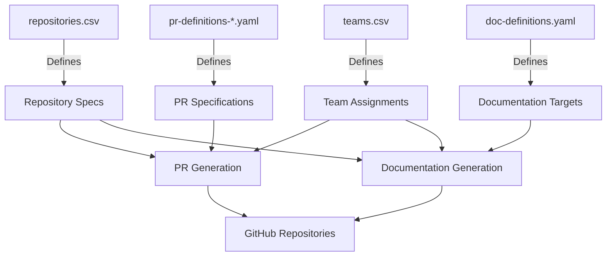
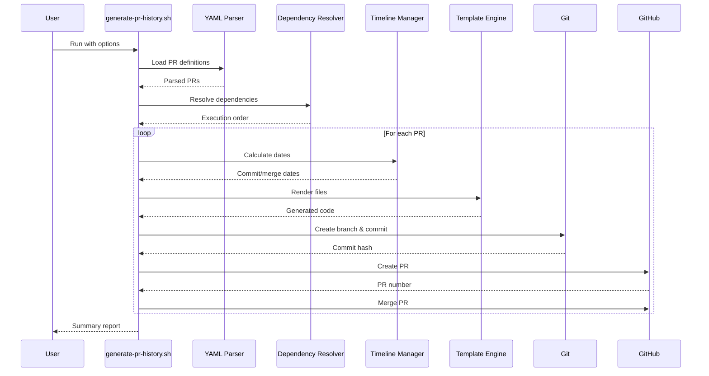
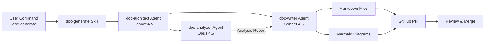

# Setup Guide

## Table of Contents

1. [Prerequisites](#prerequisites)
2. [Quick Start](#quick-start)
3. [Environment Setup](#environment-setup)
4. [Repository Structure](#repository-structure)
5. [Configuration Management](#configuration-management)
6. [PR Generation System](#pr-generation-system)
7. [Documentation System](#documentation-system)
8. [Development Workflows](#development-workflows)
9. [Common Tasks](#common-tasks)
10. [Troubleshooting](#troubleshooting)

## Prerequisites

### Required Software

| Tool | Version | Purpose | Installation |
|------|---------|---------|--------------|
| Git | 2.43+ | Version control | `brew install git` |
| GitHub CLI | 2.40+ | GitHub automation | `brew install gh` |
| Claude Code | Latest | AI development | https://claude.ai/claude-code |
| Bash | 4.0+ | Automation scripts | macOS: `brew install bash` |
| jq | 1.6+ | JSON processing | `brew install jq` |
| yq | 4.x | YAML processing | `brew install yq` |

### Optional Tools

| Tool | Purpose | Installation |
|------|---------|--------------|
| direnv | Auto-load environment | `brew install direnv` |
| fzf | Fuzzy file finder | `brew install fzf` |
| bat | Better cat with syntax highlighting | `brew install bat` |

### Account Requirements

- GitHub account with access to polybase-poc and omnibase-poc organizations
- Personal Access Token (PAT) with `repo`, `workflow`, `admin:org` scopes
- Claude Code account

### System Requirements

- macOS 12+ or Linux
- 8GB RAM minimum (16GB recommended)
- 10GB free disk space
- Internet connection

## Quick Start

### 5-Minute Setup

```bash
# 1. Clone the repository
cd ~/wrk
git clone https://github.com/leo-levintza/first-agentic-ai.git
cd first-agentic-ai

# 2. Load environment variables
source .envrc

# 3. Verify GitHub authentication
gh auth status

# 4. Verify access to organizations
gh repo list polybase-poc --limit 5
gh repo list omnibase-poc --limit 5

# 5. Test a script
./scripts/validate-pr-generation.sh --check-only

# Done! You're ready to use the system.
```

### Verify Installation

Run this command to verify all prerequisites:

```bash
cat > /tmp/verify-setup.sh << 'EOF'
#!/bin/bash
echo "Checking prerequisites..."

check() {
  if command -v $1 &> /dev/null; then
    echo "✓ $1 installed: $(command -v $1)"
  else
    echo "✗ $1 NOT FOUND"
    return 1
  fi
}

check git
check gh
check bash
check jq
check yq

echo ""
echo "Checking GitHub authentication..."
if gh auth status &> /dev/null; then
  echo "✓ GitHub CLI authenticated"
else
  echo "✗ GitHub CLI not authenticated - run: gh auth login"
fi

echo ""
echo "Checking environment variables..."
if [ -n "$GITHUB_TOKEN" ]; then
  echo "✓ GITHUB_TOKEN set"
else
  echo "✗ GITHUB_TOKEN not set"
fi

echo ""
echo "Setup verification complete!"
EOF

chmod +x /tmp/verify-setup.sh
/tmp/verify-setup.sh
```

## Environment Setup

### Environment Variables

The project uses `.envrc` for environment configuration. This file is loaded automatically by `direnv` or manually with `source .envrc`.

#### Required Variables

```bash
# GitHub Authentication
export GITHUB_TOKEN="ghp_xxxxxxxxxxxxxxxxxxxx"
export ORG_ADMIN_PAT="$GITHUB_TOKEN"

# Organization Names
export MULTIREPO_ORG="polybase-poc"
export MONOREPO_ORG="omnibase-poc"

# Local Workspace Paths
export BASE_DIR="/Users/leo.levintza/wrk"
export PROJECT_ROOT="$BASE_DIR/first-agentic-ai"
export POLYBASE_DIR="$BASE_DIR/polybase"
export OMNIBASE_DIR="$BASE_DIR/omnybase"

# Configuration Paths
export CONFIG_DIR="$PROJECT_ROOT/config"
export TEMPLATE_DIR="$PROJECT_ROOT/templates"
export SCRIPT_DIR="$PROJECT_ROOT/scripts"
export LOG_DIR="$PROJECT_ROOT/logs"
```

#### Optional Variables

```bash
# Execution Options
export DRY_RUN="false"
export VERBOSE="false"
export PARALLEL_EXECUTION="true"

# GitHub Settings
export DEFAULT_BRANCH="main"
export PR_BASE_BRANCH="main"

# Timeline Settings
export SIMULATE_TIMELINE="true"
export REVIEW_TIME_HOURS="4"
```

### Setting Up Environment

#### Method 1: Using direnv (Recommended)

```bash
# Install direnv
brew install direnv

# Add to shell profile (~/.zshrc or ~/.bashrc)
eval "$(direnv hook zsh)"  # or bash

# Allow direnv in project
cd /Users/leo.levintza/wrk/first-agentic-ai
direnv allow

# Variables are now auto-loaded when entering directory
```

#### Method 2: Manual Loading

```bash
# Add to ~/.zshrc or ~/.bashrc
alias load-agentic='source /Users/leo.levintza/wrk/first-agentic-ai/.envrc'

# Then run before using scripts
load-agentic
```

#### Method 3: Source Before Each Command

```bash
cd /Users/leo.levintza/wrk/first-agentic-ai
source .envrc
./scripts/generate-pr-history.sh
```

### GitHub Authentication

#### Setting Up GitHub CLI

```bash
# Login to GitHub
gh auth login

# Choose:
# - GitHub.com
# - HTTPS
# - Authenticate with web browser (or paste token)

# Verify authentication
gh auth status

# Test access to organizations
gh api user/orgs | jq '.[].login'
```

#### Creating Personal Access Token

1. Go to GitHub Settings → Developer settings → Personal access tokens → Tokens (classic)
2. Click "Generate new token (classic)"
3. Set expiration (recommend 90 days)
4. Select scopes:
   - `repo` (Full control of private repositories)
   - `workflow` (Update GitHub Action workflows)
   - `admin:org` (Full control of orgs and teams)
   - `admin:repo_hook` (Full control of repository hooks)
5. Generate and copy token
6. Add to `.envrc`:
   ```bash
   export GITHUB_TOKEN="ghp_your_token_here"
   ```

### AWS Credentials (Optional)

If using AWS Bedrock for Claude Code:

```bash
# The project includes automated credential management
# Credentials are auto-refreshed when expired

# Manual refresh (if needed)
./scripts/refresh-aws

# Verify credentials
aws sts get-caller-identity
```

## Repository Structure

### Project Layout

```
first-agentic-ai/                     # Main project directory
├── .claude/                          # Claude Code integration
│   ├── agents/                       # Custom agents (3 files)
│   ├── skills/                       # Custom skills (3 files)
│   ├── scripts/                      # Claude helper scripts
│   └── settings.json                 # Claude configuration
│
├── config/                           # Configuration files
│   ├── repositories.csv              # Repository definitions
│   ├── teams.csv                     # Team assignments
│   ├── workspace.conf                # Local paths
│   ├── doc-definitions.yaml          # Documentation config
│   └── pr-definitions-*.yaml         # PR configurations (4 files)
│
├── scripts/                          # Automation scripts
│   ├── generate-pr-history.sh        # Main PR generator
│   ├── automated-doc-generation.sh   # Documentation automation
│   ├── deploy-doc-system.sh          # Deploy doc system
│   ├── generate-monorepo-service.sh  # Monorepo service generator
│   ├── setup-github-infrastructure.sh # GitHub setup
│   └── lib/                          # Shared libraries (20+ files)
│
├── templates/                        # Code templates (183 files)
│   ├── common/                       # Shared across all types
│   ├── java-service/                 # Spring Boot templates
│   ├── node-service/                 # Express/TypeScript
│   ├── react-app/                    # React/Vite
│   ├── mobile-ios/                   # Swift templates
│   ├── mobile-android/               # Kotlin templates
│   ├── terraform/                    # Infrastructure
│   ├── database/                     # PostgreSQL/Liquibase
│   ├── team-configs/                 # Team-specific configs
│   └── documentation/                # Doc templates
│
├── images/                           # Presentation visuals (7 SVG)
├── logs/                             # Execution logs
├── docs/                             # Project documentation
│   ├── ARCHITECTURE.md               # System architecture
│   └── SETUP.md                      # This file
│
└── README.md                         # Project overview
```

### External Repositories

The system manages 20 external repositories:

```
~/wrk/polybase/                       # Multi-repo workspace
├── user-service/                     # Java/Spring Boot
├── auth-service/                     # Java/Spring Boot
├── order-service/                    # Java/Spring Boot
├── payment-service/                  # Java/Spring Boot
├── notification-service/             # Java/Spring Boot
├── web-bff/                          # Node.js/TypeScript
├── mobile-bff/                       # Node.js/TypeScript
├── graphql-gateway/                  # Node.js/TypeScript
├── web-app/                          # React/Vite
├── component-library/                # React/Vite
├── ios-app/                          # Swift
├── android-app/                      # Kotlin
├── mobile-shared/                    # React Native
├── db-schemas/                       # PostgreSQL
├── db-migrations/                    # Liquibase
├── terraform-aws-infrastructure/     # Terraform
├── grafana-dashboards/               # Config
├── prometheus-alerts/                # Config
└── claude-configs-shared/            # Shared configs

~/wrk/omnybase/                       # Monorepo workspace
└── enterprise-monorepo/              # Nx workspace
    ├── services/                     # Backend services
    ├── apps/                         # Frontend applications
    ├── libs/                         # Shared libraries
    └── tools/                        # Build tools
```

### Cloning Repositories

#### Clone All Multi-Repo Repositories

```bash
# Create workspace directory
mkdir -p ~/wrk/polybase
cd ~/wrk/polybase

# Clone all repositories
for repo in user-service auth-service order-service payment-service \
    notification-service web-bff mobile-bff graphql-gateway web-app \
    component-library ios-app android-app mobile-shared db-schemas \
    db-migrations terraform-aws-infrastructure grafana-dashboards \
    prometheus-alerts claude-configs-shared; do
  gh repo clone polybase-poc/$repo
done
```

#### Clone Monorepo

```bash
mkdir -p ~/wrk/omnybase
cd ~/wrk/omnybase
gh repo clone omnibase-poc/enterprise-monorepo
```

#### Clone Specific Repository

```bash
gh repo clone polybase-poc/user-service ~/wrk/polybase/user-service
```

## Configuration Management

### Configuration Files Overview



### Editing Configuration Files

#### 1. Adding a New Repository

Edit `config/repositories.csv`:

```csv
# Format: org,name,type,description,visibility,team
polybase-poc,analytics-service,java-service,"Analytics and reporting service",private,backend
```

**Columns**:
- `org`: GitHub organization (polybase-poc or omnibase-poc)
- `name`: Repository name (lowercase, hyphen-separated)
- `type`: Template type (java-service, node-service, react-app, etc.)
- `description`: Human-readable description
- `visibility`: private or public
- `team`: Owning team slug

**Create the repository**:
```bash
./scripts/setup-github-infrastructure.sh --repo analytics-service
```

#### 2. Adding a New Team

Edit `config/teams.csv`:

```csv
# Format: org,team_name,team_slug,description,permission
polybase-poc,QA Engineers,qa,"Quality assurance and testing",push
```

**Create the team**:
```bash
gh api orgs/polybase-poc/teams \
  -f name="QA Engineers" \
  -f description="Quality assurance and testing" \
  -f privacy="closed"
```

#### 3. Adding PR Definitions

Edit `config/pr-definitions-month1-2.yaml`:

```yaml
prs:
  - id: "BACKEND-042"
    title: "Add rate limiting middleware"
    description: |
      Implement rate limiting to prevent API abuse.
      - Add Redis for rate limit storage
      - Configure limits per endpoint
      - Add metrics for tracking
    repository: "user-service"
    author: "Backend Team"
    labels:
      - "enhancement"
      - "security"
      - "backend"
    target_date: "2025-09-10"
    review_time_hours: 6
    depends_on:
      - "INFRA-005"  # Requires Redis setup
    files:
      - path: "src/main/java/com/example/middleware/RateLimiter.java"
        template: "java-service/RateLimiter.java"
      - path: "src/main/resources/application.yml"
        template: "java-service/application-ratelimit.yml"
        merge: true
      - path: "src/test/java/com/example/middleware/RateLimiterTest.java"
        template: "java-service/RateLimiterTest.java"
```

**Fields**:
- `id`: Unique identifier (TEAM-NUMBER format)
- `title`: PR title (concise, descriptive)
- `description`: PR body (supports multi-line with `|`)
- `repository`: Target repository name
- `author`: Team or individual
- `labels`: Array of GitHub labels
- `target_date`: Target merge date (YYYY-MM-DD)
- `review_time_hours`: Simulated review duration
- `depends_on`: Array of PR IDs this depends on
- `files`: Array of files to generate
  - `path`: Target file path in repository
  - `template`: Template file to use
  - `merge`: If true, merge with existing file

#### 4. Configuring Documentation Targets

Edit `config/doc-definitions.yaml`:

```yaml
documentation_targets:
  - repo: analytics-service
    org: polybase-poc
    team: backend
    priority: high
    doc_types:
      - readme
      - architecture
      - api
      - setup
    diagrams:
      - architecture_overview
      - sequence_analytics_flow
    notes: "Analytics and reporting service"
```

### Validating Configuration

#### Validate Repository Configuration

```bash
# Check CSV syntax
column -t -s',' config/repositories.csv | less

# Validate all repositories exist
while IFS=, read -r org name rest; do
  [[ "$org" == "org" ]] && continue  # Skip header
  gh repo view "$org/$name" &> /dev/null && echo "✓ $org/$name" || echo "✗ $org/$name"
done < config/repositories.csv
```

#### Validate PR Definitions

```bash
# Validate YAML syntax
for file in config/pr-definitions-*.yaml; do
  echo "Validating $file..."
  yq eval . "$file" > /dev/null && echo "✓ Valid" || echo "✗ Invalid"
done

# Check for dependency issues
./scripts/validate-pr-generation.sh --check-dependencies
```

#### Validate Team Configuration

```bash
# List all teams
gh api orgs/polybase-poc/teams | jq -r '.[] | "\(.slug): \(.name)"'

# Verify team membership
gh api orgs/polybase-poc/teams/backend/members | jq -r '.[].login'
```

## PR Generation System

### Overview

The PR generation system creates pull requests across repositories based on YAML configuration files.



### Basic Usage

#### Generate All PRs

```bash
cd /Users/leo.levintza/wrk/first-agentic-ai
source .envrc

# Generate all PRs for polybase-poc
./scripts/generate-pr-history.sh --org polybase-poc

# Generate all PRs for omnibase-poc
./scripts/generate-pr-history.sh --org omnibase-poc
```

#### Generate Specific PRs

```bash
# Generate PRs from a specific config file
./scripts/generate-pr-history.sh \
  --org polybase-poc \
  --config-dir ./config \
  --config-file pr-definitions-month1-2.yaml

# Generate PRs for a specific repository
./scripts/generate-pr-history.sh \
  --org polybase-poc \
  --repo user-service

# Resume from a specific PR
./scripts/generate-pr-history.sh \
  --org polybase-poc \
  --resume-from BACKEND-020
```

#### Dry Run Mode

```bash
# Preview what would be generated
./scripts/generate-pr-history.sh --org polybase-poc --dry-run

# Output shows:
# - PRs that would be created
# - Dependencies resolved
# - Timeline calculated
# - Files to be generated
```

### Advanced Options

```bash
./scripts/generate-pr-history.sh [OPTIONS]

Options:
  --org ORG               Target organization (polybase-poc or omnibase-poc)
  --repo REPO             Target specific repository only
  --dry-run               Preview without creating PRs
  --resume-from ID        Resume from specific PR ID
  --config-dir DIR        Directory with PR YAML files (default: ../config)
  --config-file FILE      Specific YAML file to process
  --log-file FILE         Log file path (default: ../logs/pr-generation.log)
  --parallel              Generate independent PRs in parallel
  --skip-merge            Create PRs but don't merge them
  --no-timeline           Don't backdate commits (use current time)
  --verbose               Show detailed progress
  --help                  Show help message

Examples:
  # Generate all PRs with parallel execution
  ./scripts/generate-pr-history.sh --org polybase-poc --parallel

  # Dry run for specific month
  ./scripts/generate-pr-history.sh \
    --org polybase-poc \
    --config-file pr-definitions-month1-2.yaml \
    --dry-run

  # Create PRs without merging (for manual review)
  ./scripts/generate-pr-history.sh \
    --org polybase-poc \
    --skip-merge

  # Resume after failure
  ./scripts/generate-pr-history.sh \
    --org polybase-poc \
    --resume-from BACKEND-025
```

### Monitoring Progress

#### Watch PR Generation

```bash
# Watch in real-time
./scripts/watch-pr-progress.sh polybase-poc

# Output updates every 5 seconds with:
# - PRs created
# - PRs merged
# - Current status
# - Estimated completion time
```

#### Check Progress

```bash
# Get summary of PR status
./scripts/monitor-pr-progress.sh polybase-poc

# Shows:
# Total PRs: 38
# Created: 25 (66%)
# Merged: 20 (53%)
# Open: 5 (13%)
# Failed: 0 (0%)
```

#### View Logs

```bash
# Tail the log file
tail -f logs/pr-generation.log

# View errors only
grep ERROR logs/pr-generation.log

# View specific PR generation
grep "BACKEND-020" logs/pr-generation.log
```

### Throttling

To avoid GitHub rate limits:

```bash
# Generate PRs with throttling (5-second delay between PRs)
./scripts/throttled-pr-generation.sh polybase-poc 5

# Custom delay (10 seconds)
./scripts/throttled-pr-generation.sh polybase-poc 10
```

### Validation

```bash
# Validate PR generation setup
./scripts/validate-pr-generation.sh --check-only

# Checks:
# - YAML syntax valid
# - All templates exist
# - Dependencies are valid
# - Repositories accessible
# - No cyclic dependencies

# Generate validation report
./scripts/validate-pr-generation.sh --report > validation-report.txt
```

## Documentation System

### Overview

The documentation system uses Claude Code Skills and Agents to automatically generate comprehensive documentation for repositories.



### Skills Available

#### 1. /doc-generate

Generate comprehensive documentation for a repository or organization.

```bash
# In Claude Code

# Generate for single repository
/doc-generate user-service

# Generate for entire organization
/doc-generate polybase-poc

# Generate for all repositories
/doc-generate all

# Options
/doc-generate user-service --dry-run     # Preview only
/doc-generate user-service --force       # Regenerate existing
/doc-generate user-service --skip-pr     # Don't create PR
```

#### 2. /doc-update

Update existing documentation (incremental).

```bash
# Update specific sections
/doc-update user-service --sections api,setup

# Update stale documentation
/doc-update user-service --stale-only

# Update diagrams only
/doc-update user-service --diagrams-only
```

#### 3. /doc-check

Check documentation freshness and quality.

```bash
# Check single repository
/doc-check user-service

# Check all repositories
/doc-check --all

# Output:
# ✓ user-service: Documentation up to date (3 days old)
# ⚠ auth-service: Documentation stale (21 days old)
# ✗ order-service: Missing ARCHITECTURE.md
```

### Manual Documentation Generation

Without Claude Code:

```bash
# Generate documentation using script
./scripts/automated-doc-generation.sh --repo user-service

# Generate for organization
./scripts/automated-doc-generation.sh --org polybase-poc

# Dry run
./scripts/automated-doc-generation.sh --repo user-service --dry-run
```

### Documentation Standards

The system generates these files:

**Required**:
- `README.md`: Project overview, quick start, links
- `docs/ARCHITECTURE.md`: System design, components, patterns
- `docs/SETUP.md`: Development environment setup

**Recommended**:
- `docs/API.md`: API endpoints, request/response formats
- `docs/DEPLOYMENT.md`: Deployment procedures
- `docs/CONTRIBUTING.md`: Contribution guidelines

**Optional**:
- `docs/TROUBLESHOOTING.md`: Common issues and solutions
- `docs/FAQ.md`: Frequently asked questions
- `docs/PERFORMANCE.md`: Performance considerations

### Customizing Documentation

Edit `config/doc-definitions.yaml` to control:

```yaml
documentation_targets:
  - repo: user-service
    org: polybase-poc
    team: backend
    priority: high              # high, medium, low
    doc_types:                  # Which docs to generate
      - readme
      - architecture
      - api
      - setup
      - deployment
      - contributing
    diagrams:                   # Which diagrams to include
      - architecture_overview
      - sequence_authentication
      - erd_user_models
    notes: "Core authentication service"
```

### Deploying Documentation System

To set up the documentation system in a new repository:

```bash
# Deploy to single repository
./scripts/deploy-doc-system.sh --repo user-service

# Deploy to all repositories
./scripts/deploy-doc-system.sh --all

# What it does:
# 1. Copies .claude/agents/*.agent.md
# 2. Copies .claude/skills/*.skill.md
# 3. Updates .claude/settings.json
# 4. Creates docs/ directory structure
```

## Development Workflows

### Working with Multi-Repo (polybase-poc)

#### Making Changes to a Service

```bash
# 1. Navigate to repository
cd ~/wrk/polybase/user-service

# 2. Create feature branch
git checkout -b feature/add-pagination

# 3. Make changes
# ... edit files ...

# 4. Test changes
mvn clean test

# 5. Commit changes
git add .
git commit -m "feat: add pagination to user list endpoint"

# 6. Push and create PR
git push -u origin feature/add-pagination
gh pr create --title "Add pagination to user list endpoint" \
  --body "Implements pagination with page and size parameters"

# 7. Review and merge
gh pr view  # Review in browser
gh pr merge --squash
```

#### Working Across Multiple Services

```bash
# Change affecting user-service and auth-service

# Terminal 1: user-service
cd ~/wrk/polybase/user-service
git checkout -b feature/update-auth-integration
# ... make changes ...
git commit -am "feat: update auth client"
git push -u origin feature/update-auth-integration
gh pr create

# Terminal 2: auth-service  
cd ~/wrk/polybase/auth-service
git checkout -b feature/update-auth-integration
# ... make changes ...
git commit -am "feat: add new auth endpoint"
git push -u origin feature/update-auth-integration
gh pr create

# Coordinate merges (auth-service first, then user-service)
```

### Working with Monorepo (omnibase-poc)

#### Making Changes to a Service

```bash
# 1. Navigate to monorepo
cd ~/wrk/omnybase/enterprise-monorepo

# 2. Create feature branch
git checkout -b feature/add-user-pagination

# 3. Make changes to specific service
# ... edit services/user-service/... ...

# 4. Test affected services only
nx test user-service

# 5. Test affected dependencies
nx affected:test --base=main

# 6. Commit and push
git add .
git commit -m "feat(user-service): add pagination"
git push -u origin feature/add-user-pagination

# 7. Create PR
gh pr create
```

#### Working Across Multiple Services

```bash
# Change affecting multiple services

cd ~/wrk/omnybase/enterprise-monorepo
git checkout -b feature/shared-pagination-library

# 1. Create shared library
mkdir -p libs/pagination
# ... create library files ...

# 2. Update services to use library
# ... edit services/user-service/... ...
# ... edit services/order-service/... ...

# 3. Test all affected services
nx affected:test --base=main
nx affected:lint --base=main
nx affected:build --base=main

# 4. Commit and push
git add .
git commit -m "feat: add shared pagination library"
git push -u origin feature/shared-pagination-library
gh pr create
```

### Using Claude Code

#### Starting Claude Code

```bash
# Navigate to repository
cd ~/wrk/polybase/user-service

# Start Claude Code
claude code

# Claude Code loads:
# - .claude/settings.json
# - .claude/rules/*.md
# - .claude/agents/*.agent.md
# - .claude/skills/*.skill.md
```

#### Using Skills

```bash
# In Claude Code session

# Generate documentation
/doc-generate

# Update documentation
/doc-update --sections api

# Check documentation freshness
/doc-check

# Other built-in skills
/commit         # Create git commit
/review-pr      # Review pull request
/simplify       # Simplify code
```

## Common Tasks

### Task 1: Add Health Endpoint to All Java Services

```bash
cd /Users/leo.levintza/wrk/first-agentic-ai

# Option 1: Using PR generation
# Add to config/pr-definitions-month1-2.yaml:
cat >> config/pr-definitions-month1-2.yaml << 'EOF'
  - id: "BACKEND-050"
    title: "Add health check endpoint"
    repository: "user-service"
    author: "Backend Team"
    labels: ["enhancement", "backend"]
    target_date: "2025-09-15"
    files:
      - path: "src/main/java/com/example/controller/HealthController.java"
        template: "java-service/HealthController.java"
EOF

# Generate PR
./scripts/generate-pr-history.sh --org polybase-poc --resume-from BACKEND-050

# Repeat for other services (auth-service, order-service, etc.)

# Option 2: Manual approach
for service in user-service auth-service order-service payment-service notification-service; do
  cd ~/wrk/polybase/$service
  git checkout -b feature/add-health-endpoint
  
  # Copy health endpoint template
  cp $TEMPLATE_DIR/java-service/HealthController.java \
     src/main/java/com/example/controller/HealthController.java
  
  git add .
  git commit -m "feat: add health check endpoint"
  git push -u origin feature/add-health-endpoint
  gh pr create --fill
done
```

### Task 2: Update Dependencies Across All Node Services

```bash
# Update package.json for all Node services

for service in web-bff mobile-bff graphql-gateway mobile-shared; do
  cd ~/wrk/polybase/$service
  
  git checkout -b chore/update-dependencies
  
  # Update dependencies
  npm update
  npm audit fix
  
  # Test
  npm test
  
  # Commit and push
  git add package*.json
  git commit -m "chore: update dependencies"
  git push -u origin chore/update-dependencies
  gh pr create --title "Update dependencies" --body "Update to latest compatible versions"
done
```

### Task 3: Generate Documentation for All Repositories

```bash
# Option 1: Using Claude Code skill
# In Claude Code session:
/doc-generate polybase-poc

# Option 2: Using script
./scripts/automated-doc-generation.sh --org polybase-poc

# Option 3: Selective generation
for repo in user-service auth-service order-service; do
  ./scripts/automated-doc-generation.sh --repo $repo
done
```

### Task 4: Create New Service

```bash
# For multi-repo (polybase-poc)

# 1. Add to config/repositories.csv
echo "polybase-poc,analytics-service,java-service,\"Analytics and reporting\",private,backend" >> config/repositories.csv

# 2. Create repository
./scripts/setup-github-infrastructure.sh --repo analytics-service

# 3. Clone locally
cd ~/wrk/polybase
gh repo clone polybase-poc/analytics-service

# 4. Initial development
cd analytics-service
# Repository is pre-scaffolded with Spring Boot structure

# For monorepo (omnibase-poc)

# 1. Generate service in monorepo
./scripts/generate-monorepo-service.sh analytics-service backend

# 2. Navigate and develop
cd ~/wrk/omnybase/enterprise-monorepo
cd services/analytics-service
# Service is generated with Nx configuration
```

### Task 5: Sync Fork with Upstream

```bash
# Assuming you forked a polybase-poc repository

cd ~/wrk/polybase/user-service

# Add upstream remote (once)
git remote add upstream https://github.com/polybase-poc/user-service.git

# Sync with upstream
git fetch upstream
git checkout main
git merge upstream/main
git push origin main
```

### Task 6: Create Hotfix

```bash
# Critical bug in production

cd ~/wrk/polybase/user-service

# Create hotfix branch from main
git checkout main
git pull
git checkout -b hotfix/fix-authentication-bug

# Make fix
# ... edit files ...

# Test
mvn clean test

# Commit with conventional commit
git commit -am "fix: correct authentication token validation"

# Push and create PR with high priority
git push -u origin hotfix/fix-authentication-bug
gh pr create \
  --title "HOTFIX: Fix authentication token validation" \
  --label "hotfix" \
  --label "priority:high"

# Request immediate review
gh pr view --web
```

## Troubleshooting

### Common Issues

#### Issue 1: GitHub Authentication Failed

**Symptoms**:
```
error: failed to push some refs
fatal: Authentication failed
```

**Solution**:
```bash
# Check authentication status
gh auth status

# If expired, re-authenticate
gh auth login

# Verify token has required scopes
gh auth status | grep Token

# Update git credential helper
git config --global credential.helper "!gh auth git-credential"
```

#### Issue 2: PR Generation Fails with Dependency Error

**Symptoms**:
```
ERROR: Cyclic dependency detected: BACKEND-020 -> BACKEND-015 -> BACKEND-020
```

**Solution**:
```bash
# Visualize dependency graph
./scripts/lib/dependency-resolver.sh --visualize > deps.dot
dot -Tpng deps.dot -o deps.png
open deps.png

# Fix in YAML (remove or reorder dependencies)
# Then validate
./scripts/validate-pr-generation.sh --check-dependencies
```

#### Issue 3: Template Variables Not Substituted

**Symptoms**:
Files contain `{{REPO_NAME}}` instead of actual value.

**Solution**:
```bash
# Check template exists
ls -la $TEMPLATE_DIR/java-service/

# Verify template path in PR definition
grep "template:" config/pr-definitions-*.yaml

# Test template rendering
./scripts/lib/template-engine.sh \
  --template $TEMPLATE_DIR/java-service/Application.java \
  --var REPO_NAME=user-service \
  --var SERVICE_NAME=UserService
```

#### Issue 4: Claude Code Not Loading Skills

**Symptoms**:
`/doc-generate` shows "unknown command"

**Solution**:
```bash
# Check skills are present
ls -la .claude/skills/

# Verify settings.json references skills
cat .claude/settings.json | jq '.skills'

# Deploy documentation system
cd /Users/leo.levintza/wrk/first-agentic-ai
./scripts/deploy-doc-system.sh --repo user-service

# Restart Claude Code
```

#### Issue 5: Repository Not Found

**Symptoms**:
```
ERROR: Repository polybase-poc/user-service not found
```

**Solution**:
```bash
# Check repository exists
gh repo view polybase-poc/user-service

# If not exists, create it
./scripts/setup-github-infrastructure.sh --repo user-service

# Verify access
gh repo list polybase-poc | grep user-service

# Check organization membership
gh api user/orgs | jq -r '.[].login'
```

#### Issue 6: YAML Parsing Error

**Symptoms**:
```
ERROR: Invalid YAML syntax at line 42
```

**Solution**:
```bash
# Validate YAML syntax
yq eval . config/pr-definitions-month1-2.yaml

# Use yamllint for detailed errors
brew install yamllint
yamllint config/pr-definitions-month1-2.yaml

# Common issues:
# - Inconsistent indentation (use 2 spaces)
# - Missing colon after key
# - Unquoted special characters
```

### Logs and Debugging

#### Enable Verbose Logging

```bash
# For PR generation
./scripts/generate-pr-history.sh --verbose --org polybase-poc

# For documentation generation
./scripts/automated-doc-generation.sh --verbose --repo user-service

# Enable bash debugging
bash -x ./scripts/generate-pr-history.sh --org polybase-poc
```

#### View Logs

```bash
# Tail log file
tail -f logs/pr-generation.log

# View specific date range
grep "2026-04-09" logs/pr-generation.log

# View errors only
grep "ERROR\|FATAL" logs/pr-generation.log

# View specific PR
grep "BACKEND-020" logs/pr-generation.log | less
```

#### Debug Mode

```bash
# Run with debug mode
export DEBUG=true
./scripts/generate-pr-history.sh --org polybase-poc

# Shows:
# - Variables values
# - Function entry/exit
# - API calls
# - Template processing steps
```

### Getting Help

#### Resources

1. Project documentation:
   - `README.md` - Project overview
   - `docs/ARCHITECTURE.md` - System architecture
   - `docs/SETUP.md` - This file
   - `AGENT_HANDOFF_GUIDE.md` - Agent onboarding

2. Script help:
   ```bash
   ./scripts/generate-pr-history.sh --help
   ./scripts/automated-doc-generation.sh --help
   ```

3. GitHub:
   - Issues: https://github.com/leo-levintza/first-agentic-ai/issues
   - Discussions: https://github.com/leo-levintza/first-agentic-ai/discussions

#### Reporting Issues

When reporting an issue, include:

1. Command that failed:
   ```bash
   ./scripts/generate-pr-history.sh --org polybase-poc
   ```

2. Error message:
   ```
   ERROR: Failed to create PR BACKEND-020
   ```

3. Environment information:
   ```bash
   # Run and include output
   echo "OS: $(uname -a)"
   echo "Bash: $BASH_VERSION"
   gh --version
   git --version
   ```

4. Relevant logs:
   ```bash
   tail -20 logs/pr-generation.log
   ```

---

## Quick Reference

### Essential Commands

```bash
# Environment
source .envrc                                # Load environment

# Repository operations
gh repo clone polybase-poc/user-service      # Clone repo
gh repo view polybase-poc/user-service       # View repo details
gh repo list polybase-poc                    # List all repos

# PR generation
./scripts/generate-pr-history.sh \
  --org polybase-poc                         # Generate all PRs
./scripts/generate-pr-history.sh \
  --org polybase-poc --dry-run               # Preview PRs

# Documentation
/doc-generate user-service                   # In Claude Code
./scripts/automated-doc-generation.sh \
  --repo user-service                        # From command line

# Validation
./scripts/validate-pr-generation.sh          # Validate PR setup
./scripts/monitor-pr-progress.sh polybase-poc # Check PR progress

# Debugging
tail -f logs/pr-generation.log               # Watch logs
grep ERROR logs/pr-generation.log            # View errors
```

### File Paths Reference

```bash
# Main project
/Users/leo.levintza/wrk/first-agentic-ai

# Configuration
/Users/leo.levintza/wrk/first-agentic-ai/config/
├── repositories.csv
├── teams.csv
├── pr-definitions-*.yaml
└── doc-definitions.yaml

# Scripts
/Users/leo.levintza/wrk/first-agentic-ai/scripts/
├── generate-pr-history.sh
├── automated-doc-generation.sh
└── lib/

# Templates
/Users/leo.levintza/wrk/first-agentic-ai/templates/

# Repositories
/Users/leo.levintza/wrk/polybase/           # Multi-repo
/Users/leo.levintza/wrk/omnybase/           # Monorepo
```

---

**Last Updated**: 2026-04-09  
**Version**: 1.0  
**Maintained By**: Documentation Architect Agent
